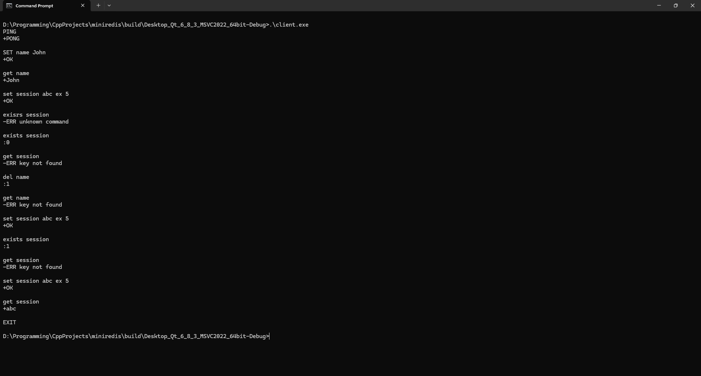
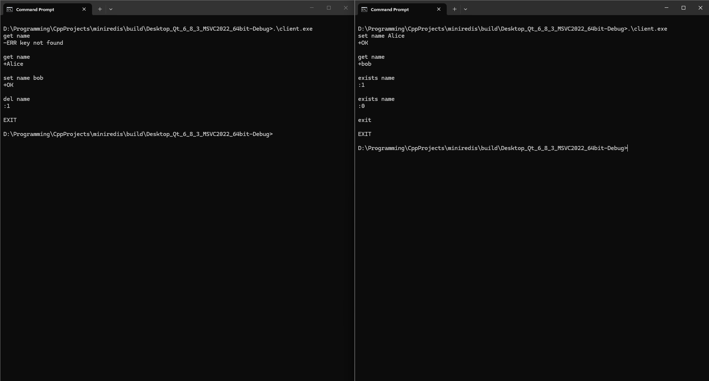
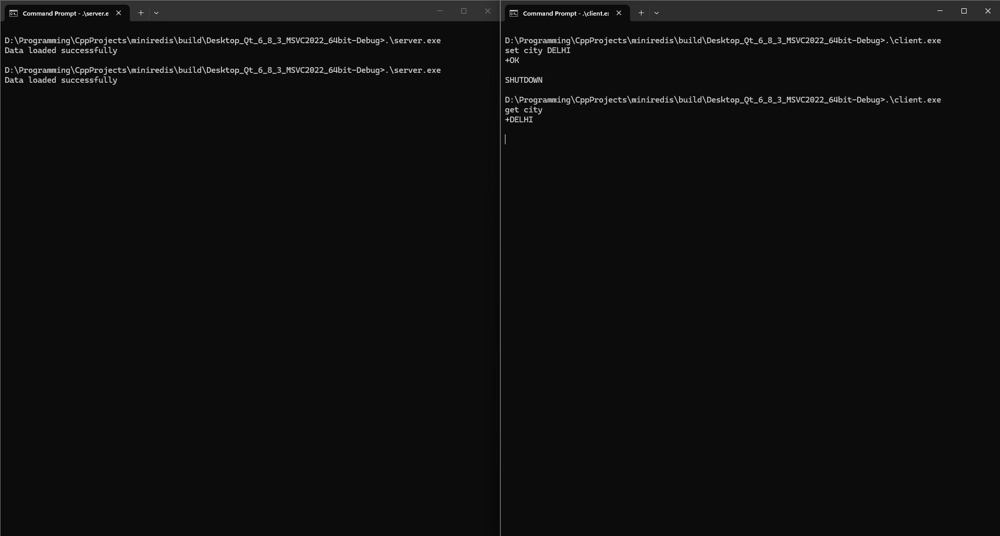

# miniredis

A lightweight in-memory key-value store built from scratch in C++, inspired by Redis. Supports multiple simultaneous clients, key expiry (TTL), and data persistence across restarts.

---

## Screenshots

**Server starting up**


**Client session**



**Multiple clients simultaneously**



**Data persistence across restarts**



---

## Features

- `SET`, `GET`, `DEL`, `EXISTS`, `PING` commands
- TTL support — keys automatically expire after a set time
- Multiple simultaneous clients via multithreading
- Thread-safe store using `std::mutex`
- Data persistence — saves to file on shutdown, reloads on startup
- Case insensitive commands
- Graceful shutdown via `SHUTDOWN` command or `Ctrl+C`

---

## Architecture

The project is split into three components:

**Store** (`src/store.h` / `src/store.cpp`)
The core data layer. Holds all key-value pairs in a `std::unordered_map` in RAM. A second map tracks expiry times using `std::chrono::steady_clock`. A `std::mutex` protects both maps from concurrent access. Expired keys are cleaned up lazily — only when accessed, not on a background thread.

**Server** (`src/server.h` / `src/server.cpp`)
Opens a TCP socket on the configured port and enters an accept loop. Every time a client connects, a new `std::thread` is spawned to handle that client independently. All threads share the same `Store` instance. Each thread reads commands from its socket, parses them, executes against the store, and sends back a response.

**Client** (`client/main.cpp`)
A simple TCP client that connects to the server, reads commands from the terminal, sends them over the socket, and prints the response.

```
Server
├── creates ONE Store instance
└── acceptLoop()
      ├── Client 1 connects → Thread 1 → handleClient()
      ├── Client 2 connects → Thread 2 → handleClient()
      └── Client 3 connects → Thread 3 → handleClient()
                                              │
                                         store.get() / store.set()
                                           (mutex locks here)
```

---

## Build

**Requirements**
- Windows
- CMake 3.16+
- A C++17 compiler (MSVC or MinGW)

**Steps**
```bash
git clone https://github.com/PratyakshSinha/miniredis.git
cd miniredis
cmake -B build
cmake --build build
```

This produces two executables in the `build/` folder: `server.exe` and `client.exe`.

---

## Usage

Start the server first:
```bash
.\build\server.exe
```

Then connect with the client in a separate terminal:
```bash
.\build\client.exe
```

You can open multiple client terminals simultaneously — each gets its own connection.

---

## Commands

| Command | Example | Response | Description |
|---------|---------|----------|-------------|
| `PING` | `PING` | `+PONG` | Health check |
| `SET` | `SET name John` | `+OK` | Store a value |
| `SET EX` | `SET session abc EX 10` | `+OK` | Store with TTL in seconds |
| `GET` | `GET name` | `+John` | Retrieve a value |
| `DEL` | `DEL name` | `:1` / `:0` | Delete a key |
| `EXISTS` | `EXISTS name` | `:1` / `:0` | Check if key exists |
| `SHUTDOWN` | `SHUTDOWN` | `+OK shutting down` | Save and shut down server |
| `EXIT` | `EXIT` | — | Disconnect client |

Response prefixes follow Redis convention: `+` success, `-` error, `:` integer.

Commands are case insensitive — `ping`, `Ping`, and `PING` all work.

---

## Known Limitations

- Values cannot contain spaces
- `SHUTDOWN` can be called by any connected client
- Data is saved on clean shutdown only — if the process is killed forcefully, unsaved data is lost

---

## What I Learned

Building this project gave me hands-on experience with three areas I had little prior exposure to:

**TCP Networking** — I had never written socket code before. Learning how `socket()`, `bind()`, `listen()`, and `accept()` work together — and how the same `send()`/`recv()` functions are used symmetrically on both sides of a connection — gave me a clear mental model of how networked applications actually communicate.

**Multithreading and race conditions** — Understanding why a `std::mutex` is necessary when multiple threads access shared data was one of the most valuable things I took away. Without it, two threads calling `store.set()` simultaneously could corrupt the hashmap silently — the kind of bug that's extremely hard to track down.

**How Redis works at a fundamental level** — Before this project I had heard of Redis but never understood it. Building a simplified version from scratch — in-memory storage, TTL via lazy deletion, file-based persistence — made the core ideas concrete rather than abstract.